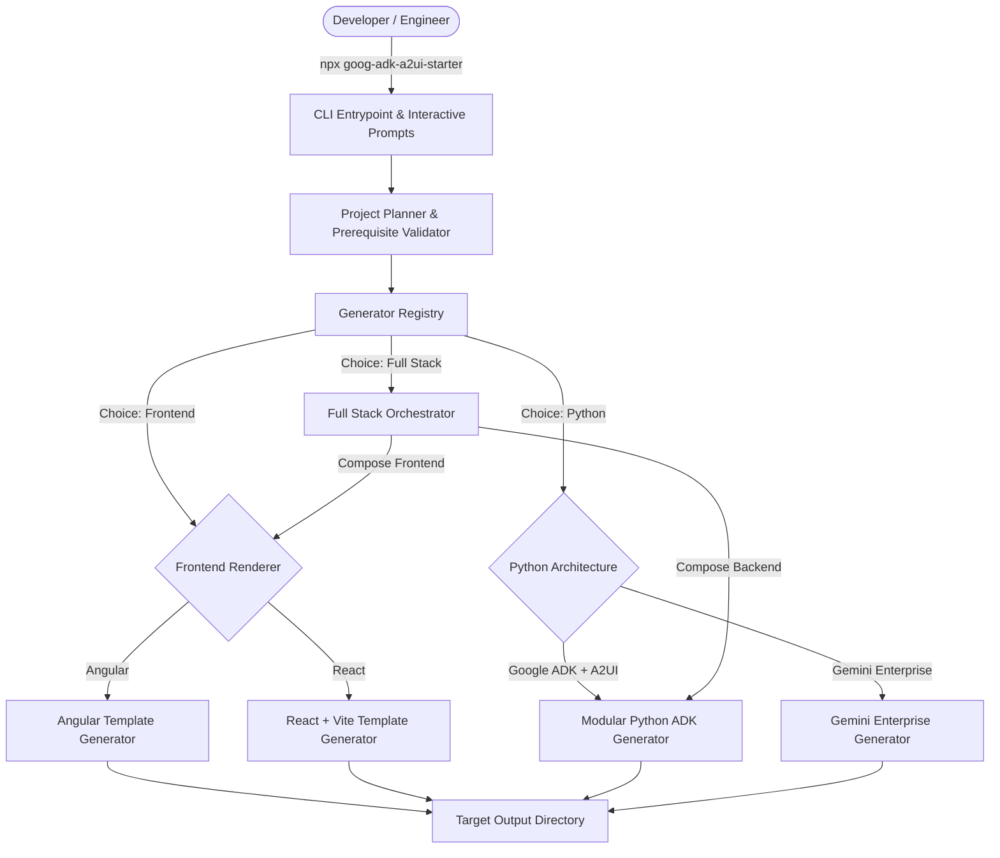
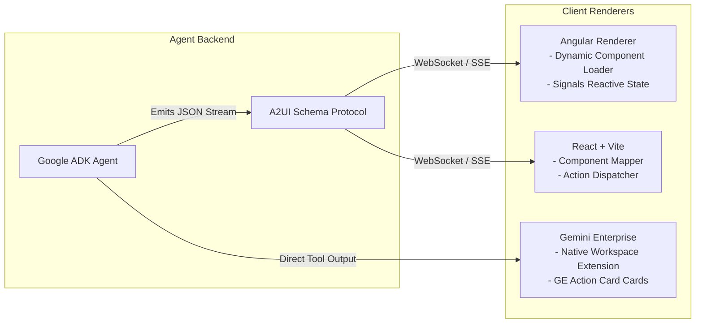
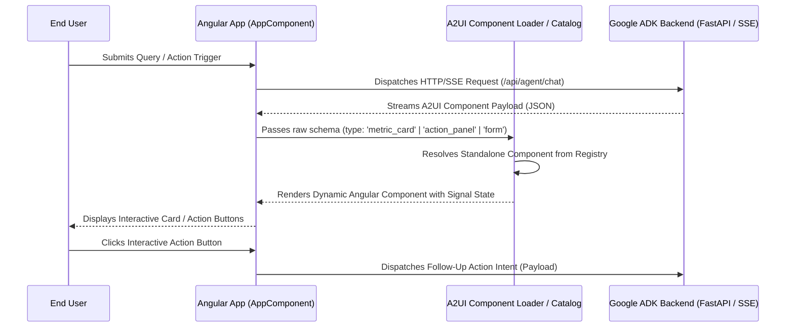
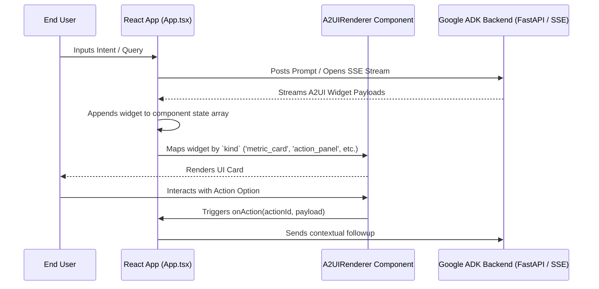
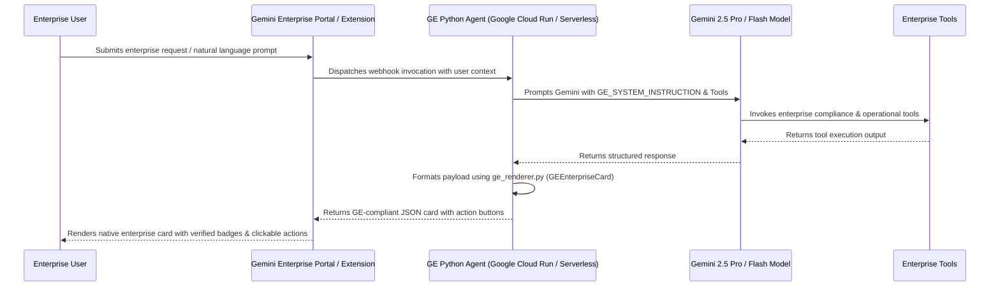
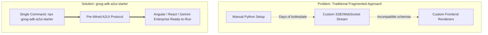
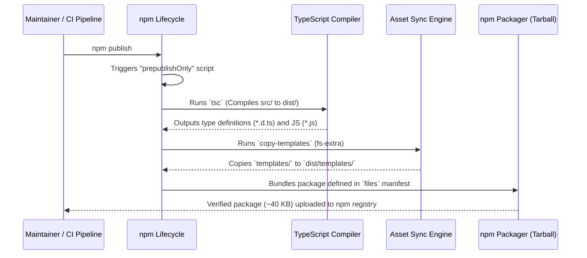

# Architecture Document: goog-adk-a2ui-starter

## 1. Executive Summary & Mission

**`goog-adk-a2ui-starter`** is an official developer-centric scaffolding CLI framework designed to accelerate the creation of **Agent-to-User Interface (A2UI)** applications and **Google Agent Development Kit (ADK)** agents.

Modern agentic systems require rich, interactive, and structured user interfaces that seamlessly bridge AI reasoning engines with web and enterprise frontends. Instead of returning plain markdown text, Google ADK agents emit dynamic A2UI schema components (metric cards, interactive forms, action buttons, live streams, and grounded data tables).

`goog-adk-a2ui-starter` provides an instantaneous, zero-friction scaffolding experience for:
- **Angular Clients**: Standalone component architecture with dynamic A2UI schema catalogs.
- **React Clients**: High-performance React 18/19 + TypeScript + Vite clients.
- **Python Google ADK Agents**: Fully modularized agent backends (`agent.py`, `agent_executor.py`, `tools.py`, `prompt.py`, `config.py`, and optional `server.py`).
- **Gemini Enterprise (GE) Renderers**: Pure Python agent logic with native Gemini Enterprise UI card renderers.
- **Full-Stack Monorepos**: Composed frontend and backend environments with unified orchestration.

---

## 2. Core Architectural Philosophy

### 2.1 100% Template-Driven Generation
Unlike traditional CLI wrappers that invoke external heavyweight generator commands at runtime (such as `ng new` or `npm create vite@latest`), `goog-adk-a2ui-starter` is **100% template-driven**:
- **Zero External CLI Dependencies**: Users do not need `@angular/cli` or other framework CLIs pre-installed globally.
- **Hermetic & Predictable**: All template assets, configurations, stylesheets, and boilerplate code are packaged directly inside the starter pack distribution.
- **Instantaneous Scaffolding**: Project generation is instantaneous file synthesis and variable interpolation rather than multi-minute external scaffolding processes.
- **Pre-Wired for A2UI**: Templates come pre-configured with A2UI-compatible JSON schema handlers, rendering hooks, and Google ADK agent conventions out of the box.

### 2.2 Generator Framework Pattern (Separation of Concerns)
The starter pack is designed as an extensible, pluggable generator framework rather than a monolithic script:
- **Interactive Prompt Engine**: Collects user preferences, validates inputs, and ensures prerequisites.
- **Project Planner**: Resolves target directories, validates naming rules, and plans directory hierarchies.
- **Generator Registry**: Dispatches work to specialized generator classes adhering to a common `IGenerator` interface.
- **Full-Stack Composition**: Full-stack projects are composed dynamically by orchestrating frontend and backend generators into isolated `frontend/` and `backend/` subtrees.
- **Renderer Specialization**: Tailors code generation specifically to the target client environment (Angular, React, or Gemini Enterprise).

---

## 3. High-Level System Architecture



---

## 4. Comprehensive Flow for Every Renderer

`goog-adk-a2ui-starter` supports three distinct rendering targets: **Angular**, **React + Vite**, and **Gemini Enterprise (GE)**.



### 4.1 Angular Renderer Flow
*Inspired by the official A2UI Angular client architecture (`@a2ui-project/a2ui/samples/client/angular/projects/restaurant`).*



#### Angular Architectural Characteristics:
1. **Standalone Components**: Zero NgModule overhead; bootstrapped via `bootstrapApplication()`.
2. **Signal-Based Reactivity**: Uses Angular `signal()`, `computed()`, and reactive effects for UI updates.
3. **Component Catalog**: Schema-to-component registry mapping incoming A2UI types (`metric_card`, `action_panel`, `form`, `table`) to Angular view elements.
4. **Bidirectional Action Dispatching**: Action buttons rendered inside dynamic cards can emit events back to the Google ADK agent.

---

### 4.2 React (+ Vite + TypeScript) Renderer Flow
*Inspired by the official A2UI React client architecture (`@a2ui-project/a2ui/samples/client/react`).*



#### React Architectural Characteristics:
1. **Vite Fast Refresh & ESM**: Sub-millisecond HMR with modern TypeScript tooling.
2. **Dynamic A2UIRenderer**: Pure functional component pattern that maps JSON widgets into interactive cards.
3. **Optimistic & Streaming State**: Designed to support real-time Server-Sent Events (SSE) and WebSocket feeds.
4. **Modern UI System**: Dark-mode glassmorphic styling with `lucide-react` icon mappings.

---

### 4.3 Gemini Enterprise (GE) Renderer Flow
**Special Architectural Rule**: *If Gemini Enterprise (GE) is selected, the starter pack generates exclusively the Python code tailored for Gemini Enterprise.*

#### Why Python-only for Gemini Enterprise?
In Gemini Enterprise, the frontend rendering engine is natively hosted within the Google Workspace and Gemini Enterprise web portal / Chrome extensions. Client frontend code is not needed because the GE host environment consumes structured tool executions and adaptive enterprise cards emitted by the backend agent webhook.



#### Gemini Enterprise Architectural Characteristics:
1. **Action Card Serialization**: `ge_renderer.py` produces `GEEnterpriseCard` structures with action buttons and security badges.
2. **Enterprise Compliance**: Tailored for SOC2, HIPAA, DLP, and internal governance workflows.
3. **Direct Enterprise Tool Execution**: Seamlessly connects to enterprise tools, APIs, and operational data services.

---

## 5. Modular Python Agent Architecture (ADK Engine)

To adhere to enterprise software engineering standards, the Python backend agent is structured into clean, modular, single-responsibility components:

```text
src/
├── __init__.py           # Package exports and version
├── config.py             # Centralized configuration (AgentConfig & env vars)
├── prompt.py             # System instructions, schema guidelines & prompts
├── tools.py              # Tool definitions, schemas & tool registry
├── agent_executor.py     # Reasoning loop, tool calling & A2UI synthesis
├── agent.py              # Main Agent interface & CLI runner
└── server.py             # (Optional) FastAPI / SSE streaming server
```

```mermaid
graph TD
    Config[config.py\n- Model Name\n- API Keys\n- Server Port] --> Agent[agent.py\n- ADKAgent Interface\n- CLI Runner]
    Prompt[prompt.py\n- System Instructions\n- A2UI Schema Rules] --> Executor[agent_executor.py\n- Reasoning Loop\n- A2UI Widget Synthesis]
    Tools[tools.py\n- Search Tool\n- Analytics Tool\n- Tool Registry] --> Executor
    Config --> Executor
    Executor --> Agent
    Agent --> Server[server.py (Optional)\n- FastAPI REST API\n- SSE Stream / CORS]
```

### Module Responsibilities:

| Module | Responsibility | Key Symbols / Classes |
| :--- | :--- | :--- |
| **`config.py`** | Centralizes environment variables, Gemini model selection, server host/port, and Vertex AI parameters. | `AgentConfig`, `config` |
| **`prompt.py`** | Contains system instructions, domain prompt templates, and strict A2UI JSON schema output rules. | `SYSTEM_INSTRUCTION`, `A2UI_SCHEMA_GUIDELINES` |
| **`tools.py`** | Defines agent callable tools, parameter schemas, and registers them in a centralized tool registry. | `ToolDefinition`, `TOOL_REGISTRY`, `AVAILABLE_TOOLS` |
| **`agent_executor.py`** | The execution heart: connects Gemini model reasoning, invokes tools, and converts raw outputs into A2UI widgets. | `AgentExecutor`, `A2UIWidget` |
| **`agent.py`** | The public agent facade: wraps the executor and provides an interactive CLI test runner. | `ADKAgent`, `main()` |
| **`server.py`** *(Optional)* | Lightweight FastAPI server exposing REST and SSE streaming endpoints for web frontend clients. | `FastAPI app`, `/api/agent/chat`, `health_check()` |

---

## 6. Generated Project Directory Layouts

### 6.1 Frontend: Angular (`frontend` -> `angular`)
```text
my-angular-app/
├── src/
│   ├── app/
│   │   ├── app.component.ts      # A2UI reactive state & action dispatcher
│   │   ├── app.component.html    # A2UI card stream view template
│   │   └── app.component.css     # Modern responsive styling
│   ├── index.html                # HTML5 entry with Google Fonts
│   ├── main.ts                   # Standalone bootstrapApplication
│   └── styles.css                # Global base styles
├── angular.json                  # Standalone Angular build configuration
├── package.json                  # Angular 18+ dependencies
├── tsconfig.json                 # TypeScript compiler options
├── tsconfig.app.json             # App TypeScript configuration
├── README.md
└── .gitignore
```

### 6.2 Frontend: React (`frontend` -> `react`)
```text
my-react-app/
├── src/
│   ├── components/
│   │   └── A2UIRenderer.tsx      # Schema-driven dynamic UI component
│   ├── App.tsx                   # Interactive intent dispatcher & state store
│   ├── App.css                   # Glassmorphism layout styling
│   ├── index.css                 # Base theme styles
│   └── main.tsx                  # React 18/19 DOM entrypoint
├── vite.config.ts                # Vite build and server configuration
├── index.html                    # Single-page application host
├── package.json                  # React + Vite dependencies
├── tsconfig.json                 # TypeScript configuration
├── tsconfig.node.json            # Vite node environment tsconfig
├── README.md
└── .gitignore
```

### 6.3 Python: Google ADK + A2UI (`python` -> `adk-a2ui`)
```text
my-python-agent/
├── src/
│   ├── __init__.py
│   ├── config.py                 # Configuration & environment loader
│   ├── prompt.py                 # System instructions & A2UI guidelines
│   ├── tools.py                  # Tool definitions & registry
│   ├── agent_executor.py         # Reasoning loop & A2UI card synthesis
│   ├── agent.py                  # Agent facade & CLI runner
│   └── server.py                 # FastAPI backend server
├── tests/
│   ├── __init__.py
│   └── test_agent.py             # Pytest test suite
├── pyproject.toml                # Managed with modern `uv`
├── .env.example                  # Environment template
├── README.md
└── .gitignore
```

### 6.4 Python: Gemini Enterprise (`python` -> `gemini-enterprise`)
```text
my-ge-agent/
├── src/
│   ├── __init__.py
│   ├── config.py                 # Enterprise config & GCP credentials
│   ├── prompt.py                 # Enterprise instructions & prompts
│   ├── tools.py                  # Enterprise compliance & operational tools
│   ├── ge_renderer.py            # Gemini Enterprise card serializer
│   ├── agent_executor.py         # Enterprise reasoning & card orchestration
│   └── agent.py                  # Enterprise agent interface & runner
├── tests/
│   ├── __init__.py
│   └── test_agent.py             # Unit tests for GE payloads
├── pyproject.toml                # uv configuration with google-genai
├── .env.example
├── README.md
└── .gitignore
```

### 6.5 Full-Stack Monorepo (`fullstack`)
```text
my-fullstack-app/
├── frontend/                     # Angular or React application
├── backend/                      # Modular Google ADK Python Agent
├── package.json                  # Root orchestration scripts (dev:frontend, dev:backend)
└── README.md
```

---

## 7. Internal CLI Engine & Generator Lifecycle

Every generator adheres to the `IGenerator` lifecycle contract:

```typescript
export interface IGenerator {
  readonly id: string;
  readonly name: string;
  readonly description: string;
  generate(targetDir: string, config: ProjectConfig): Promise<GenerationResult>;
  getPrerequisites(config: ProjectConfig): PrerequisiteRequirement[];
  getNextSteps(targetDir: string, config: ProjectConfig): string[];
}
```

### Generation Lifecycle:
1. **Interactive Prompt**: `@clack/prompts` gathers user choices (Project Type, Renderer, Name).
2. **Directory Validation**: Ensures target directory is valid and warns if non-empty.
3. **Prerequisite Check**: Validates required tools (`node`, `npm`, `python3`, `uv`).
4. **Template Copy & Interpolation**: Recursively copies template files and interpolates `{{PROJECT_NAME}}`, `{{PROJECT_TITLE}}`, etc.
5. **Post-Processing**: Finalizes file permissions and returns actionable next steps.

---

## 8. Template Variable Interpolation

| Variable | Description | Example |
| :--- | :--- | :--- |
| `{{PROJECT_NAME}}` | Sanitized hyphenated project identifier | `my-analytics-agent` |
| `{{PROJECT_TITLE}}` | Human-readable capitalized title | `My Analytics Agent` |
| `{{FRONTEND_TYPE}}` | Selected frontend framework | `Angular` or `React` |

---

## 9. Error Handling & Safety Invariants

1. **Non-Destructive Scaffolding**: Will not overwrite existing non-empty directories without explicit confirmation.
2. **Partial Generation Safety**: Retains scaffolded files for inspection if an external step fails.
3. **Clean Process Handling**: Cleanly traps `SIGINT` (Ctrl+C) without unhandled rejection errors.

---

---

## 10. Overall Goal & Strategic System Design

### 10.1 Strategic Mission
The overarching objective of **`goog-adk-a2ui-starter`** is to reduce the barrier to entry for developing **Agent-to-User Interface (A2UI)** and **Google Agent Development Kit (ADK)** applications from days of boilerplate setup down to **under 5 seconds**.

Traditional AI agent development separates backend LLM logic from frontend user interfaces, forcing developers to manually implement custom streaming protocols, schema validators, and component renderers. `goog-adk-a2ui-starter` unifies this ecosystem by providing pre-integrated, production-grade templates that instantly connect Google GenAI models with reactive web clients (Angular, React) and enterprise portals (Gemini Enterprise).



### 10.2 Architectural Invariants & Guarantees
1. **Zero External Generator Dependencies**: 100% template-driven. Scaffolding works offline and requires no network downloads of `@angular/cli` or Vite generators during project generation.
2. **Framework Freedom with Protocol Consistency**: Whether a developer chooses Angular, React, or Gemini Enterprise, the underlying **A2UI JSON Schema contract** (`metric_card`, `action_panel`, `form`, `table`) remains identical.
3. **Decoupled Yet Composable**: Frontend and Backend projects can be generated independently as standalone repositories or composed seamlessly as a full-stack monorepo.
4. **Cross-Platform Parity**: First-class execution support across **macOS, Linux, and Windows** without OS-specific script dependencies.

---

## 11. Packaging & Build Pipeline

The packaging pipeline guarantees that the distributed npm package is completely self-contained, lightweight, and executable immediately upon download.



### 11.1 Build Lifecycle Specification (`package.json`)
- **`npm run build`**: Compiles TypeScript sources (`src/` $\to$ `dist/`) with declaration maps and copies all template assets into `dist/templates/`.
- **`prepublishOnly`**: Automated guard hook ensuring that any invocation of `npm publish` triggers a clean build and template synchronization prior to packaging.
- **Binary Shebang & File Permissions**: The entrypoint (`dist/index.js`) contains `#!/usr/bin/env node` and is marked with executable permissions (`0755`) so operating systems execute it directly via the Node.js runtime.

### 11.2 Package Manifest & Tarball Optimization
The package only includes production runtime artifacts, keeping the download size under **50 KB**:
```json
{
  "files": [
    "dist",
    "templates",
    "README.md",
    "architecture.md",
    "plan.md"
  ]
}
```

---

## 12. Distribution & Publishing Strategy

### 12.1 Target Registry & Namespace
- **Primary Registry**: Public npm Registry (`https://registry.npmjs.org/`)
- **Package Identifier**: `goog-adk-a2ui-starter` (Single unified unscoped package name)

### 12.2 Authentication & Security Controls
1. **Granular Access Tokens**: Published using npm access tokens with Two-Factor Authentication (2FA) enforcement.
2. **CI/CD Automated Publishing**: Configured via GitHub Actions / Cloud Build utilizing OpenID Connect (OIDC) provenance verification for verifiable supply-chain security.

### 12.3 Versioning Strategy (SemVer)
- **Patch (`1.0.x`)**: Template bug fixes, styling adjustments, or documentation updates.
- **Minor (`1.x.0`)**: New renderer targets, additional agent tools, or enhanced prompt templates.
- **Major (`x.0.0`)**: Breaking changes to CLI prompt flows or core A2UI schema protocol definitions.

---

## 13. Public Consumption & Execution Modes

Once published, any developer in the global software community can invoke `goog-adk-a2ui-starter` across multiple execution environments:

### 13.1 Instant Ephemeral Execution via `npx` (Primary Recommended Mode)
Requires zero prior installation. `npx` fetches the package to an ephemeral cache, runs the interactive scaffolder, and removes temporary binaries:
```bash
npx goog-adk-a2ui-starter
```

### 13.2 Standard Project Initializers (`npm create`, `yarn create`, `pnpm create`)
Adheres to the official npm initialization convention:
```bash
# npm
npm create goog-adk-a2ui-starter

# yarn
yarn create goog-adk-a2ui-starter

# pnpm
pnpm create goog-adk-a2ui-starter
```

### 13.3 Global CLI Installation
For developers or offline environments performing frequent project creation:
```bash
npm install -g goog-adk-a2ui-starter

# Then invoke directly from any path:
goog-adk-a2ui-starter
```

### 13.4 Headless / CI/CD Automation Mode
Supports automated scaffolding scripts, benchmark pipelines, and test suites via command-line arguments without interactive prompts:
```bash
# Scaffold React frontend non-interactively
goog-adk-a2ui-starter my-react-app --type frontend --frontend react

# Scaffold Angular frontend non-interactively
goog-adk-a2ui-starter my-angular-app --type frontend --frontend angular

# Scaffold Google ADK Python Agent non-interactively
goog-adk-a2ui-starter my-python-agent --type python --renderer adk-a2ui

# Scaffold Gemini Enterprise Python Agent non-interactively
goog-adk-a2ui-starter my-ge-agent --type python --renderer gemini-enterprise

# Scaffold Full-Stack Monorepo non-interactively
goog-adk-a2ui-starter my-fullstack-app --type fullstack --frontend react
```
